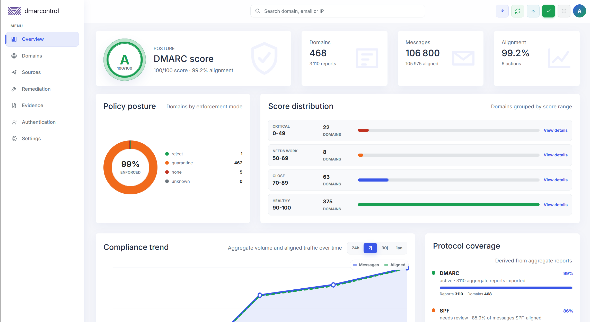

<p align="center">
  
</p>

<p align="center">
  Self-hosted DMARC aggregate report viewer for teams that want local storage, fast inspection, and a small operational footprint.
</p>



---

## Overview

Dmarcontrol imports DMARC aggregate XML reports, normalizes them into SQLite, and serves a single embedded web dashboard from a Rust binary. It is designed for operators who need to understand DMARC alignment, identify sending sources, and move domains safely from monitoring toward enforcement.

Use it as:

- A day-to-day dashboard for DMARC aggregate report review.
- A local archive for `.xml`, `.xml.gz`, and `.zip` DMARC reports.
- A remediation workspace for SPF/DKIM alignment issues.
- A lightweight mailbox importer for DMARC report attachments.

---

## Quick Start

### Docker

```bash
docker run -d \
  --name dmarcontrol \
  -p 8080:8080 \
  -v dmarcontrol-data:/app/data \
  --restart unless-stopped \
  ghcr.io/adminsyspro/dmarcontrol:latest
```

Then open `http://your-server:8080`.

Default local username is `admin`. If `DMARCONTROL_ADMIN_PASSWORD` is not set before the first start, the first local admin password defaults to `admin`.

If Docker reports `error from registry: unauthorized` when pulling from `ghcr.io/adminsyspro/dmarcontrol`, make the GitHub Container Registry package public in the package settings. The Docker workflow publishes the `latest` tag from the default branch.

### Docker Compose

```bash
cp .env.example .env
$EDITOR .env
docker compose up -d
```

The provided `docker-compose.yml` persists application data in the `dmarcontrol-data` volume.

### From source

```bash
cargo run -- --addr 127.0.0.1:8080
```

Open `http://localhost:8080`.

---

## Features

| Feature | Description |
| --- | --- |
| DMARC import | Import `.xml`, `.xml.gz`, `.gz`, `.zip`, files, and directories |
| Web upload | Upload aggregate reports directly from the dashboard |
| Mailbox sync | Pull DMARC report attachments from IMAP, manually or on a schedule |
| Compliance trend | View message volume and aligned traffic over 24h, 7d, 30d, or 1y |
| Global search | Search domains, sender emails, source IPs, reports, and remediation evidence |
| Domain intelligence | Inspect policy strength, alignment rate, sources, and recent reports per domain |
| Source analysis | Rank sending IPs by message volume, alignment, rejection, and risk |
| Remediation queue | Get prioritized action items before tightening DMARC policy |
| Geo enrichment | Enrich source IPs with country, continent, ASN, and map points using IP66 MMDB |
| CSV export | Export report evidence as CSV |
| Authentication | Local admin login plus optional OIDC single sign-on |
| Embedded UI | No frontend build pipeline or external runtime once compiled |
| Local storage | SQLite only; no database server required |
| Dark mode | Full light/dark interface |

## IP Geolocation

Dmarcontrol enriches source IPs with the free IP66 MMDB database. The Docker image includes `ip66.mmdb` out of the box, so no extra installation step is required for container deployments.

---

## Reverse Proxy

Example Nginx vhost:

```nginx
server {
    listen 443 ssl;
    server_name dmarcontrol.example.com;

    ssl_certificate     /etc/letsencrypt/live/dmarcontrol.example.com/fullchain.pem;
    ssl_certificate_key /etc/letsencrypt/live/dmarcontrol.example.com/privkey.pem;

    location / {
        proxy_pass http://127.0.0.1:8080;
        proxy_set_header Host $host;
        proxy_set_header X-Real-IP $remote_addr;
        proxy_set_header X-Forwarded-For $proxy_add_x_forwarded_for;
        proxy_set_header X-Forwarded-Proto $scheme;
    }
}
```

When serving over HTTPS, set:

```bash
DMARCONTROL_FORCE_HTTPS=true
DMARCONTROL_PUBLIC_BASE_URL=https://dmarcontrol.example.com
```

## Requirements

- Docker and Docker Compose for container deployments.
- Rust stable toolchain with `cargo` for source builds.
- Optional IMAP mailbox dedicated to DMARC aggregate reports.

---

## License

MIT.
